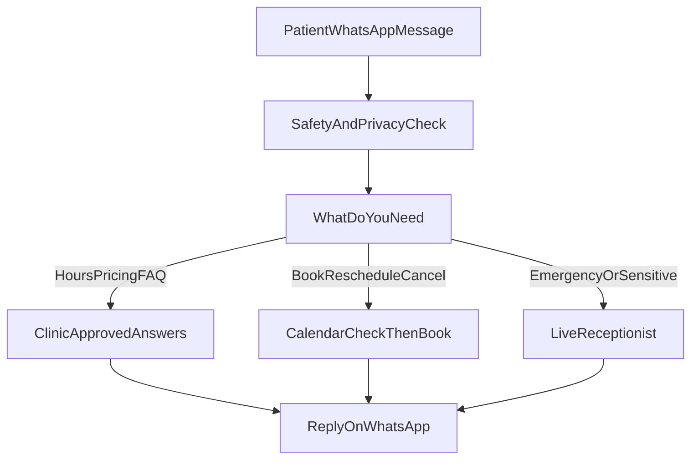

## Project Overview

**The Problem:** Front desk staff at Prandelli Dental Clinic spent 2–4 hours on average before first reply to patient messages. Confirmation calls, ignored SMS reminders, and after-hours inquiries piled up. Peak-hour phone queues pulled staff away from patients in the chair.

**The Solution:** An n8n-driven WhatsApp assistant on the Meta Business Platform handles clinic-approved FAQ answers, appointment confirm/reschedule/cancel via approved WhatsApp message templates with live Google Calendar availability, and immediate handoff to reception for emergencies or sensitive issues. Staff can take over any thread or pause the bot. Meta secure callback verification and duplicate message prevention stop duplicate bookings.

**Technologies Used**

| Layer | Stack |
| :-- | :-- |
| Orchestration | n8n |
| Channel | WhatsApp Business Platform (Meta) |
| Scheduling | Google Calendar API |
| Knowledge | Clinic-approved FAQ content from their docs |
| Safety & ops | Message routing by patient need, patient privacy checks, staff takeover |

### Architecture & Workflow

**System Architecture**

```text
Patient WhatsApp message
        │
        ▼
Meta secure callback verify → Duplicate message check
        │
        ▼
Safety & privacy check
        │
        ▼
Message router (by patient need)
        ├── FAQ / hours / pricing ──► Clinic-approved answers ──► reply
        ├── Confirm / reschedule / cancel ──► Calendar free/busy ──► template CTA ──► reply
        └── Emergency / billing / clinical ──► handoff + thread context ──► live reception
        │
        ▼
Audit log (masked identifiers) · optional staff takeover
```



### Impact & Measurable Results

**Time Saved:** Estimated 10 staff hours/week during the 90-day pilot. First response dropped from 2–4 hours to under 45 seconds.

**Performance Metrics**

- ~32% self-service completion on confirm/reschedule/cancel flows
- ~35% fewer routine confirmation calls
- No-shows cut ~18% vs pre-pilot baseline
- Escalation target: front-desk handoff alert within 5 minutes during business hours
